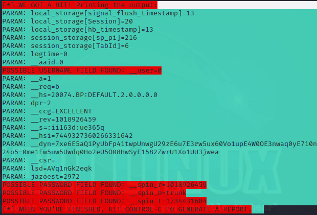

# Phishing para captura de senhas do Facebook

### Visão Geral

- Esta é uma atividade do Bootcamp Santander-DIO de Ciber Segurança.
- Eis um resumo com informações capturadas pela aplicação durante uma execução específica, elaborado para ajudar na depuração e fornecer um panorama sobre o que está acontecendo no backend da aplicação. Algumas das informações podem parecer técnicas, mas vamos explicá-las de maneira simples.
- O objetivo desta atividade é criar um clone de um site para capturar as informações de acesso de um usuário alvo, onde será utilizado um usuário e senha fictícios para caracterizar que o processo ocorreu como esperado.

### Ferramentas

- Kali Linux
- setoolkit

### Configurando o Phishing no Kali Linux

- Acesso root: ``` sudo su ```
- Iniciando o setoolkit: ``` setoolkit ```
- Tipo de ataque: ``` Social-Engineering Attacks ```
- Vetor de ataque: ``` Web Site Attack Vectors ```
- Método de ataque: ```Credential Harvester Attack Method ```
- Método de ataque: ``` Site Cloner ```
- Obtendo o endereço da máquina: ``` ifconfig ```
- URL para clone: http://www.facebook.com

### Resutados



Durante o processo de execução, diversos dados foram registrados, conforme imagem(credenciais.png). Eles incluem informações sobre a sessão do usuário, os campos de nome de usuário e senha, e algumas configurações internas da aplicação. A seguir, explicamos de maneira mais detalhada o que cada um desses dados significa.

### Detalhes dos Dados Capturados

- Informações de Sessão e Armazenamento Local
    A aplicação coletou algumas informações relacionadas à sua sessão no navegador. Esses dados ajudam a manter a continuidade da sua experiência na aplicação, como, por exemplo, manter você conectado ou lembrar o que você estava fazendo.

        Exemplo de Dados:
            local_storage[signal_flush_timestamp]=13
            session_storage[sp_pi]=216
    Esses dados não são informações pessoais, mas sim detalhes técnicos sobre como o navegador está armazenando dados temporários enquanto você usa a aplicação.

- Possível Campo de Nome de Usuário Identificado
    A aplicação identificou um campo que pode estar relacionado ao nome de usuário do usuário. Isso é parte do processo de autenticação, ou seja, quando você faz login na aplicação.

        Exemplo:
            __user=0 – Isso significa que um campo de nome de usuário foi encontrado, mas ele está vazio ou com o valor padrão (número 0).
- Possíveis Campos de Senha Encontrados
    De forma similar ao nome de usuário, a aplicação também encontrou campos que podem estar relacionados à senha. Esses campos são usados para validar se o usuário está acessando a aplicação corretamente.

        Exemplo de Dados Relacionados a Senha:
            __spin_r=1018943381
            __spin_b=trunk
    Embora esses campos sejam identificados, não há vazamento de senha aqui. Esses valores são parte da lógica interna da aplicação para verificar a segurança da autenticação.

- Outros Parâmetros e Configurações Internas
    Alguns dados são técnicos e ajudam a garantir que a aplicação funcione corretamente, como versões e configurações internas.

        Exemplo de Dados:
            __hs=20075.BP:DEFAULT.2.0.0.0.0
    Esses valores não afetam diretamente a experiência do usuário, mas são importantes para os desenvolvedores, pois ajudam a garantir que a aplicação esteja funcionando da maneira certa.

- O Que Isso Significa para a Segurança
    É importante observar que nenhuma senha ou informação sensível foi capturada de forma explícita neste log. Os valores relacionados a campos de senha e nome de usuário são identificados, mas não há risco de exposição de dados pessoais.